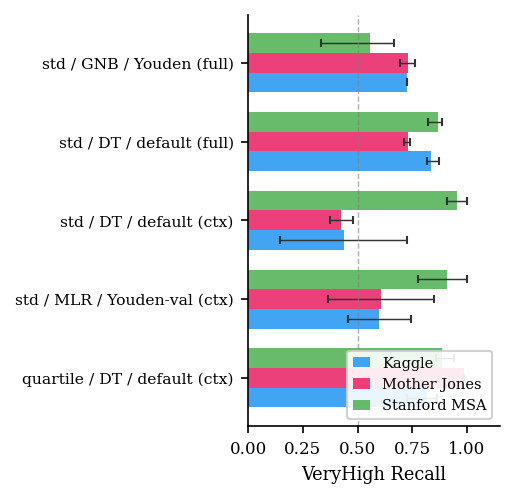
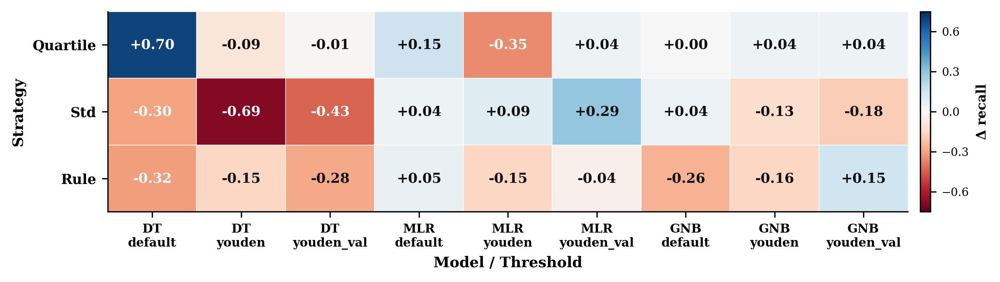

# Harmonizing Mass-Shooting Databases for Cross-Source Risk Classification

Code and harmonized schema accompanying the IEEE IRI 2026 short paper.

This repository integrates three public U.S. mass-shooting databases (Kaggle,
Mother Jones, Stanford MSA; 806 incidents) into a unified 12-variable schema
and evaluates cross-source generalization of risk classifiers under a
leakage-aware leave-one-dataset-out (LODO) protocol.

**Paper:** IEEE IRI 2026 (in press)
**Code:** https://github.com/nehasharmacs/harmonizing-mass-shooting-db

## Datasets

The three raw datasets are **not redistributed in this repository**, in line
with their respective sources' attribution and redistribution norms. Users
should obtain them directly from the original publishers (see below).

| Source       | Years     | Inclusion criterion              | Where to obtain                                                                      |
|--------------|-----------|----------------------------------|--------------------------------------------------------------------------------------|
| Kaggle       | 1966–2017 | 3+ victims                       | Kaggle search: "Mass Shootings in America" (originally compiled by Stanford)         |
| Mother Jones | 1982–2026 | 4+ killed (pre-2013), 3+ (2013+) | https://www.motherjones.com/politics/2012/12/mass-shootings-mother-jones-full-data/ |
| Stanford MSA | 1966–2016 | 3+ shooting victims              | https://github.com/StanfordGeospatialCenter/MSA                                      |

After harmonization and removal of the Las Vegas 2017 outlier, the pooled
dataset contains **806 incidents** across **12 common variables**
(`source`, `year`, `fatalities`, `injured`, `total_victims`, `incident_area`,
`open_close`, `age`, `gender`, `race`, `mental_health`, `multiple_shooters`).

The **harmonized derivative** (`data/processed/harmonized.csv`) is provided
in this repository as the output of the harmonization pipeline applied to
the three sources.

## Repository layout

```
.
├── data/
│   ├── raw/                    # download instructions only — see data/raw/README.md
│   └── processed/              # harmonized.csv, dataset_summary.csv (derivatives)
├── src/                        # core pipeline modules
│   ├── preprocess.py           # harmonization into 12-variable schema
│   ├── classification_strategies.py  # rule / std / quartile labeling
│   ├── models.py               # DT, MLR, GNB wrappers
│   ├── evaluation.py           # 5-fold CV, LODO, metrics
│   ├── run_experiments.py      # main experiment driver
│   ├── temporal_holdout.py     # pre/post-2010 temporal split
│   └── download_data.py        # fetch Mother Jones + Stanford MSA
├── scripts/                    # numbered analysis scripts
│   ├── 01_bootstrap_ci.py
│   ├── 02_wilcoxon_ablation.py
│   ├── 03_deduplication.py
│   ├── 04_ablation_depth_sweep.py
│   ├── 05_rf_baseline_youden_breakdown.py
│   ├── 06_rf_depth_pipeline.py
│   └── 07_figures.py           # regenerate paper figures
├── results/                    # experiment outputs (CSV)
├── figures/                    # paper figures (PDF + PNG)
├── LICENSE
└── README.md
```

## Installation

```bash
# Conda environment (recommended)
conda env create -f environment.yml
conda activate iri

# Or pip
pip install -r requirements.txt
```

Tested with Python 3.9 and 3.11.

## Obtaining the data

Before running the pipeline, place the three raw datasets in `data/raw/`:

```bash
# Mother Jones + Stanford MSA (auto-downloadable)
python src/download_data.py

# Kaggle "Mass Shootings in America" (manual)
# Download from Kaggle and save as:
#   data/raw/kaggle_1965_2019.csv
```

The Kaggle dataset requires a free Kaggle account; the file is not
auto-fetched because Kaggle's terms of service generally discourage
automated mirroring.

The committed `data/processed/harmonized.csv` lets you verify the paper's
headline numbers (see "Verifying paper numbers" below) without re-running
the full pipeline.

## Reproducing the paper

```bash
# 1. Obtain raw data (see "Obtaining the data" above)

# 2. Harmonize all three sources into the common schema
python src/preprocess.py

# 3. Run the full experiment grid
#    (5-fold CV + LODO across 3 strategies × 3 models × 3 threshold modes)
python src/run_experiments.py

# 4. Temporal holdout (pre-2010 vs post-2010)
python src/temporal_holdout.py

# 5. Downstream analyses
python scripts/01_bootstrap_ci.py                  # bootstrap CIs for top configs
python scripts/02_wilcoxon_ablation.py             # paired feature-set comparison
python scripts/04_ablation_depth_sweep.py          # depth selection sweep
python scripts/05_rf_baseline_youden_breakdown.py  # Youden vs default deltas

# 6. Regenerate paper figures
python scripts/07_figures.py
```

Outputs are written to `results/` (CSVs) and `figures/` (PDF + PNG).
On a modern laptop the full pipeline runs in roughly 10–20 minutes.

Scripts `03_deduplication.py` and `06_rf_depth_pipeline.py` are helper
utilities used during data preparation; they are not required to reproduce
the paper's headline numbers.

## Method summary

- **Three risk-stratification schemes** over `total_victims`: fixed
  rule-based thresholds (10/20/40), standard deviation (μ±σ, μ+2σ), and
  quartiles (Q1/Q2/Q3). Under LODO, std and quartile thresholds are
  computed only on the training fold to prevent label leakage.
- **Three classifiers**: depth-3 decision tree, L2-regularized multinomial
  logistic regression, Gaussian naïve Bayes.
- **Three decision rules**: argmax over class probabilities (default);
  per-class Youden's J thresholding computed on the training fold
  (`youden`); and Youden's J computed on a 20% stratified validation
  split held out from training before oversampling (`youden_val`).
- **Two evaluation protocols**: stratified 5-fold cross-validation on the
  pooled 806-row dataset (within-dataset), and leave-one-dataset-out
  trained on two sources and tested on the third (cross-source), repeated
  over 5 random seeds (42–46) that vary the oversampling bootstrap,
  Youden validation split, and tree tie-breaking. Under LODO the test
  fold is fully determined by the held-out source; seeds therefore
  characterize oversampling and validation-split sensitivity but do not
  exercise test-fold randomness.

## Key findings

### Cross-source recall is unstable and partly artifact-driven



The best LODO configuration reaches VeryHigh recall of 0.819 on Kaggle
and 0.886 on Stanford MSA, but the higher Mother Jones value (0.989)
reflects its 4+ fatality inclusion criterion rather than genuine
generalization. Per-seed minimum recall is 0.814 (95% CI [0.724, 0.862]).

### Feature-set effect is configuration-specific, not systematic



Across 27 paired feature-set comparisons (3 strategies × 3 models ×
3 threshold modes), the contextual-vs-full difference varies dramatically
by configuration. The strongest contextual win is quartile/DT/default
(Δ=+0.695); the strongest full-feature win is std/DT/youden (Δ=−0.689).
Because the 27 pairs share classifiers, strategies, and datasets, the
dependence structure precludes a valid pooled inference test at *n*=806
rows; we report the sign-split (12 contextual / 15 full) descriptively
rather than as inference.

### Other headline findings

- **Within-dataset VeryHigh precision is only 0.147** — approximately 85%
  of VeryHigh predictions are false positives under severe class imbalance.
  The pipeline is not suitable for operational use.
- **LODO-optimal and time-optimal configurations diverge sharply**: the
  LODO best collapses to recall 0.047 on post-2010 data, while a
  different configuration achieves 0.820 ± 0.026. Cross-source and
  cross-time evaluations select different models, suggesting they are
  complementary evaluation axes.
- **`age` is the most stable signal** across permutation and Gini-based
  feature importance methods (primary DT: 0.005, RF permutation: 0.012,
  RF Gini: 0.299); secondary rankings diverge by method.

## Ethics

This pipeline is a research artifact, not a deployable risk-assessment
system. Operational use for resource allocation or surveillance would
risk reinforcing media-coverage bias and encoding demographic proxies
as actionable risk signals. The harmonized schema and code are released
for research and audit purposes only. See the paper's Discussion section
for the full ethics and limitations discussion.

## Citation

```bibtex
@inproceedings{sharma2026harmonizing,
  title     = {Harmonizing Mass-Shooting Databases for Cross-Source Risk Classification},
  author    = {Sharma, Neha and Sharma, Ritesh},
  booktitle = {Proc. IEEE Int. Conf. Information Reuse and Integration (IRI)},
  year      = {2026},
  address   = {Seattle, WA, USA},
  month     = {Aug}
}
```

## Data attribution

- **Mother Jones**: Follman, M., Aronsen, G., & Pan, D. *U.S. Mass
  Shootings, 1982–2026*. Mother Jones.
  https://www.motherjones.com/politics/2012/12/mass-shootings-mother-jones-full-data/
- **Stanford MSA**: Stanford Geospatial Center. *Stanford Mass Shootings
  in America (MSA) Database, 1966–2016*.
  https://github.com/StanfordGeospatialCenter/MSA
- **Kaggle**: *Mass Shootings in America* dataset, originally compiled by
  the Stanford Geospatial Center.

## License

Released under the PolyForm Noncommercial License 1.0.0. Operational
deployment is explicitly prohibited. See the `LICENSE` file for full terms.
